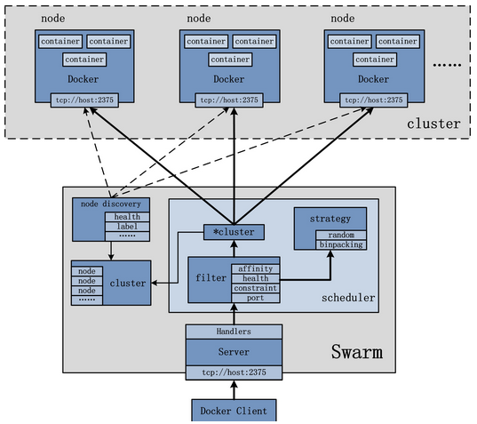

# playDockerSwarm

###[Framework](https://yeasy.gitbooks.io/docker_practice/content/swarm/intro.html)
<p align="center">
  
</p>

###[Command](https://github.com/docker/docker/tree/master/docs/reference/commandline)

- Show Node Status
  
   ```
   $ docker node ls
   ```
- Create 4 instances for tomcat8-jre8

    ```
    $ docker service create --replicas 4 --name <SERVICE_NAME> --publish 8080:8080 tomcat:8-jre8
    ```
- Create instance on specific machine and bind volume
  
  ```
  $ docker service create --name <SERVICE_NAME> \
			   --constraint node.hostname==<host_name> \
			   --publish <port_out>:<port_in> \
			   --mount type=bind,source=/path/out/cotainer,destination=/path/in/container \
			   <image_name:tag>
  ```
- Update service 
  
   ```
   $ docker service update --publish-add 8080:8080 <SERVICE_NAME>
   ```
- Restart service after making changes
  
  ```
  $ docker service update --env-add UPDATE=1 <SERVICE_NAME>
  ```
  
- Delete the service running on the swarm

  ```
  $ docker service rm <SERVICE_NAME>
  ```

- Inspect a service on the swarm

  ```
  $ docker service inspect --pretty <SERVICE_NAME>
  ```

- Show all service status

  ```
  $ docker service ls
  ```  
- Show the specific service status

  ```
  $ docker service ps <SERVICE_NAME>
  ```
- [docker service](https://docs.docker.com/engine/reference/commandline/service/)
  - [docker service create](https://github.com/docker/docker/blob/master/docs/reference/commandline/service_create.md)
    - --mount | Attach a filesystem mount to the service
    - --name | Service name
    - --publish, -p | 	Publish a port as a node port
    - --read-only | false | Mount the container’s root filesystem as read only
    - --replicas | Number of tasks
    - --restart-condition | 	Restart when condition is met (none, on-failure, or any)

- [Mount a shared-storage volume as a data volume](https://docs.docker.com/engine/tutorials/dockervolumes/#/mount-a-shared-storage-volume-as-a-data-volume)

  
- [docker secret commands](https://docs.docker.com/engine/swarm/secrets/)
  - docker secret create
  - docker secret inspect
  - docker service ls
  - docker secret rm
